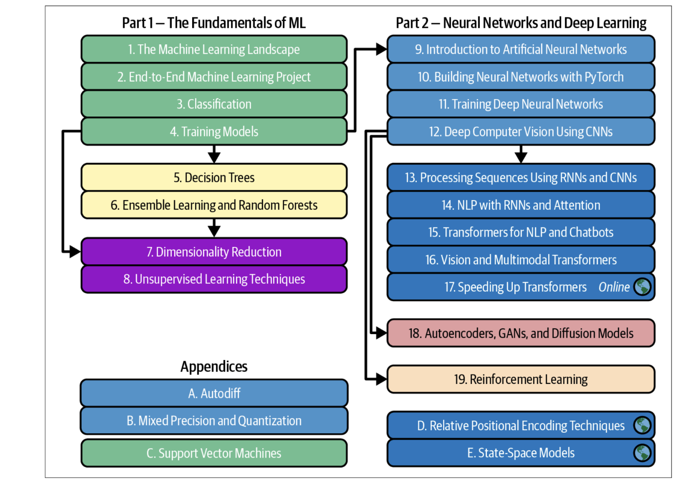

# Roadmap
Notes based on the [handson-mlp](https://github.com/ageron/handson-mlp) project.

The book is organized into two parts:
- **Part I, The Fundamentals of Machine Learning**
	- What machine learning is, the problems it solves, its main categories, and core concepts.  
	- The steps of a typical ML project.
	- How to train and evaluate models for a variety of tasks using [Scikit-Learn](https://scikit-learn.org/stable/). #sklearn 
- **Part II, Neural Networks and Deep Learning**
	- What neural networks are, how they work, and how to build and train deep learning models using [PyTorch](https://pytorch.org/). #pytorch
	- Modern Deep Learning Architectures: feedforward networks, CNNs, RNNs/LSTMs, transformers, SSMs, auto-encoders, GANs, diffusion models, and when to use each of them.
	- How to efficiently load and preprocess large datasets, and how to build agents that learn through trial and error using reinforcement learning.

If you want to reach one topic as quickly as possible, the figure below shows which chapters to read first, and which ones you can safely skip.

> Each track is the shortest path to its topic — follow the arrows and skip the rest.

>[!tip] Online content
>The online chapters 🌐 (including SVM appendix) are available [here](https://ageron.github.io/).